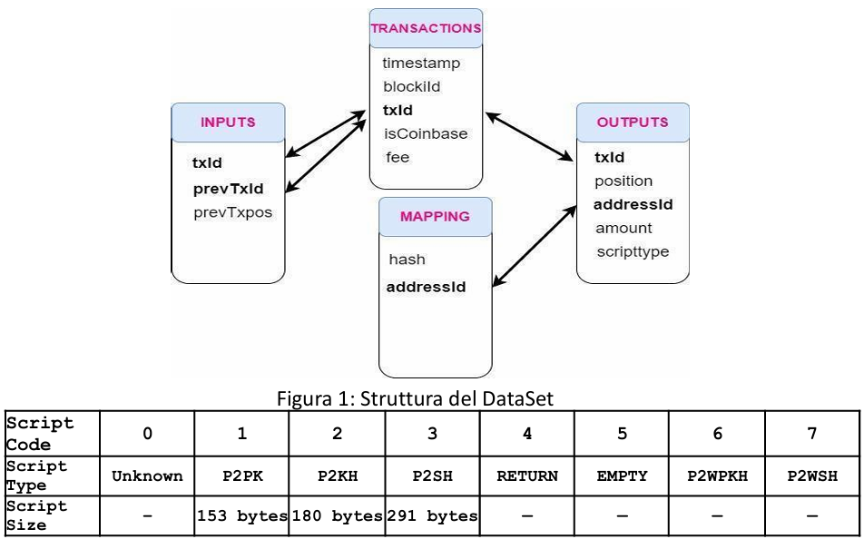

# MAGICIAN: Mining and gAmblinG servIces sCrapIng and ANalysis


## Overview
**MAGICIAN** is a Web Scraping and Data Analysis project developed for the "Web Scraping Laboratory" course (A.Y. 2024/25). 

The goal of the project is to analyze the behavior of two major Bitcoin services active during the early years of the network (2009-2012):
1.  **DeepBit.net**: One of the first and largest mining pools.
2.  **DiceOnCrack.com**: A popular Bitcoin gambling service.

By combining a subset of the Bitcoin blockchain transactions with data scraped from **WalletExplorer**, this project performs de-anonymization of addresses and analyzes transaction patterns, fee distributions, and user behaviors.

## Dataset
The analysis is based on a reduced dataset of Bitcoin transactions ranging from the **Genesis Block (2009)** to block height **214562 (Dec 31, 2012)**. The data is organized into four CSV files:

*   `transactions.csv`: Contains metadata (timestamp, blockId, txId, fees) for each transaction.
*   `inputs.csv`: Details input sources for transactions.
*   `outputs.csv`: Details transaction destinations (amounts, address IDs).
*   `mapping.csv`: Maps the unique integer IDs used in the dataset to real Bitcoin addresses (hashes).

<div style="display: flex; justify-content: center;">

</div>

## Technologies Used
*   **Python**: Core programming language.
*   **Pandas**: For efficient data manipulation and time-series analysis.
*   **BeautifulSoup**: For web scraping wallet addresses from WalletExplorer.
*   **NetworkX**: For graph construction and visualization of transaction chains.
*   **Matplotlib**: For plotting data distributions and graphs.

---

## Analysis of the services

### 1. Web Scraping & Data Acquisition
Using `requests` and `BeautifulSoup`, the project scrapes **WalletExplorer.com** to identify the wallet addresses belonging to *DeepBit.net* and *DiceOnCrack.com*. 
*   **Heuristic**: Addresses are identified and mapped to the dataset's internal IDs to label transactions associated with these services.
*   **De-anonymization**: Further scraping is performed to identify "Other" entities interacting with the mining pool.

### 2. DeepBit.net (Mining Pool Analysis)
We analyzed how the mining pool distributed rewards and collected fees.

*   **Block Distribution**: Analyzed the frequency of blocks mined by DeepBit over time (Daily, Weekly, Monthly).
*   **Fee Analysis**: Calculated the total BTC fees collected by the pool, adjusting for the 2012 Halving.
*   **UTXO Analysis**: Computed the Unspent Transaction Outputs held by the pool month-by-month.

#### Transaction Chain & Payout Pattern
We reconstructed the chain of transactions used by DeepBit to pay miners. Starting from a specific transaction, we traced the **Change Addresses**.
*   **Graph Construction**: Used `NetworkX` to build a directed graph of the payout chain.
*   **Pattern Discovery**: Identified that the pool uses a specific "change address" mechanism to handle rewards.

### 3. DiceOnCrack.com (Gambling Analysis)
We analyzed the gambling service to understand player behavior and transaction clustering.

*   **Input Clustering**: Grouped transactions within the same block to identify distinct players (wallets), excluding the casino's own addresses.
*   **Behavioral Analysis**:
    *   Identified intensive gaming sessions (multiple transactions per block).
    *   Detected privacy strategies, such as the use of **CoinJoin** transactions.
    *   Analyzed the "Average Cluster Size" to estimate user activity per block.

---

## 🚀 How to Run
1.  Clone the repository:
    ```bash
    git clone https://github.com/your-username/MAGICIAN-Project.git
    ```
2.  Install dependencies:
    ```bash
    pip install pandas matplotlib networkx beautifulsoup4 requests pyarrow
    ```
3.  Ensure the dataset CSV files (`transactions.csv`, `inputs.csv`, `outputs.csv`, `mapping.csv`) are in the root directory.
4.  Run the Jupyter Notebook:
    ```bash
    jupyter notebook MAGICIAN_Project.ipynb
    ```

---
*Disclaimer: The analysis is based on historical public blockchain data.*
---